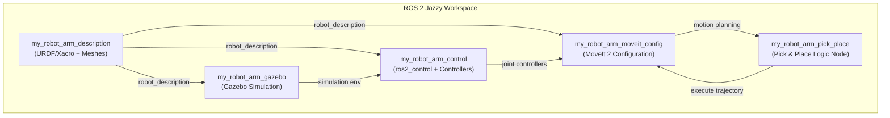

# Báo cáo Dự án: Robot Arm Pick & Place (ROS 2 Jazzy)

Báo cáo này trình bày chi tiết về dự án phát triển hệ thống **Robot Arm Pick & Place** (Gắp và Đặt vật thể tự động) sử dụng mô hình robot **Franka Emika Panda** trên nền tảng **ROS 2 Jazzy** và mô phỏng **Gazebo Sim**.

---

## 1. Yêu cầu & Mục tiêu Dự án

- **Yêu cầu:** Phát triển một hệ thống điều khiển cánh tay robot thực hiện nhiệm vụ nhận diện/lấy thông tin vị trí của vật thể từ trước, tự động tiếp cận, gắp vật thể từ vị trí A và đặt vào một vị trí B bất kỳ đã biết trước tọa độ.
- **Robot lựa chọn:** Franka Emika Panda (7 khớp xoay + 1 bộ kẹp gripper song song 2 ngón).
- **Môi trường mô phỏng:** Gazebo Sim với bàn gỗ, vật thể đích (hộp màu đỏ) và khu vực đặt đích (vùng màu xanh).

---

## 2. Kiến trúc Hệ thống & Gói ROS 2

Dự án được phân chia thành **5 packages** chuyên biệt để quản lý mã nguồn, cấu hình và tài nguyên:



### Chi tiết các Package:

1. **[my_robot_arm_description](file:///home/ddd/ros2_ws/src/my_robot_arm_description):**
   - Chứa các file mô tả robot bằng định dạng URDF/Xacro, tích hợp các cơ cấu chấp hành `ros2_control`.
   - Sử dụng các file lưới (meshes) 3D của robot Panda từ package `moveit_resources_panda_description` của hệ thống.
2. **[my_robot_arm_control](file:///home/ddd/ros2_ws/src/my_robot_arm_control):**
   - Cấu hình controller cho các khớp xoay (`JointTrajectoryController`) và cho ngón kẹp (`GripperActionController`).
   - Cung cấp launch file để chạy controller manager cùng với việc nạp (spawn) các controller theo đúng thứ tự.
3. **[my_robot_arm_gazebo](file:///home/ddd/ros2_ws/src/my_robot_arm_gazebo):**
   - Thiết lập môi trường thế giới ảo Gazebo (`pick_place_world.sdf`) gồm sàn, bàn gỗ, vật gắp màu đỏ ($0.04 \times 0.04 \times 0.04$ m) và vùng đặt màu xanh lá.
   - Nạp robot vào Gazebo sử dụng plugin `gz_ros2_control` để đồng bộ trạng thái mô phỏng.
4. **[my_robot_arm_moveit_config](file:///home/ddd/ros2_ws/src/my_robot_arm_moveit_config):**
   - Chứa cấu hình MoveIt 2 gồm file SRDF định nghĩa các nhóm lập kế hoạch (`panda_arm`, `hand`, `panda_arm_hand`).
   - Cấu hình bộ giải động học ngược (IK Solver) sử dụng plugin KDL.
5. **[my_robot_arm_pick_place](file:///home/ddd/ros2_ws/src/my_robot_arm_pick_place):**
   - Node Python chính (`pick_place_node.py`) sử dụng thư viện API Python của MoveIt 2 để thực hiện chuỗi hành động gắp thả.
   - File cấu hình YAML (`pick_place_params.yaml`) lưu trữ tọa độ của vị trí Pick và vị trí Place.

---

## 3. Cấu trúc Thư mục Nguồn cụ thể

Dưới đây là sơ đồ chi tiết các tệp quan trọng trong thư mục `/home/ddd/ros2_ws/src`:

```
src/
├── my_robot_arm_description/
│   ├── urdf/
│   │   ├── my_robot_arm.urdf.xacro          # File Xacro chính nạp mô hình Panda
│   │   ├── panda_arm.ros2_control.xacro     # Định nghĩa phần cứng ros2_control của cánh tay
│   │   └── panda_hand.ros2_control.xacro    # Định nghĩa phần cứng ros2_control của gripper
│   ├── config/
│   │   └── initial_positions.yaml           # Tư thế ban đầu của robot khi khởi chạy
│   ├── launch/
│   │   └── display.launch.py                # Hiển thị robot trong RViz2 độc lập
│   └── rviz/
│       └── display.rviz                     # Cấu hình giao diện RViz2 cơ bản
│
├── my_robot_arm_control/
│   ├── config/
│   │   └── ros2_controllers.yaml            # Khai báo các loại controller và khớp tương ứng
│   └── launch/
│       └── robot_control.launch.py          # Launch khởi chạy controller manager độc lập
│
├── my_robot_arm_gazebo/
│   ├── worlds/
│   │   └── pick_place_world.sdf             # Thiết kế bàn gỗ + vật đỏ + khu vực đích xanh
│   └── launch/
│       └── gazebo.launch.py                 # Launch mở Gazebo + Spawners
│
├── my_robot_arm_moveit_config/
│   ├── config/
│   │   ├── panda.srdf                       # Định nghĩa nhóm khớp, tư thế sẵn có, khử va chạm
│   │   ├── kinematics.yaml                  # Tham số IK Solver (KDL)
│   │   └── moveit_controllers.yaml          # Liên kết MoveIt với ros2_control actions
│   └── launch/
│       └── moveit.launch.py                 # Chạy move_group và giao diện RViz điều khiển bằng tay
│
└── my_robot_arm_pick_place/
    ├── my_robot_arm_pick_place/
    │   └── pick_place_node.py               # Node Python thực thi tự động 11 bước gắp đặt
    ├── config/
    │   └── pick_place_params.yaml           # Các tham số tọa độ x, y, z và cấu hình khoảng cách gắp
    └── launch/
        └── pick_place.launch.py             # File khởi chạy toàn bộ hệ thống tích hợp
```

---

## 4. Quy trình Tự động Hóa Pick & Place (11 Bước)

Thuật toán điều khiển của Node `pick_place_node` hoạt động theo một quy trình tuần tự khép kín để đảm bảo tính an toàn tránh va chạm:

```
[ Bước 1 ]  Di chuyển cánh tay về vị trí sẵn sàng chuẩn (Ready Pose / Home)
    │
[ Bước 2 ]  Mở ngón kẹp (Gripper) ra độ rộng tối đa (3.5 cm mỗi ngón)
    │
[ Bước 3 ]  Di chuyển đầu gắp đến điểm tiếp cận Pick (Pre-grasp - phía trên vật thể +12 cm)
    │
[ Bước 4 ]  Hạ đầu gắp xuống theo trục đứng đến tọa độ gắp vật (Grasp Pose)
    │
[ Bước 5 ]  Đóng ngón kẹp để giữ chặt khối lập phương (Grip Object)
    │
[ Bước 6 ]  Nhấc vật lên theo phương thẳng đứng (Post-grasp Retreat - lên cao +20 cm)
    │
[ Bước 7 ]  Di chuyển cánh tay đến điểm tiếp cận vị trí đặt (Pre-place - trên vị trí đặt +15 cm)
    │
[ Bước 8 ]  Hạ cánh tay xuống điểm đặt vật đích (Place Pose)
    │
[ Bước 9 ]  Mở ngón kẹp để thả vật ra (Release Object)
    │
[ Bước 10] Nhấc đầu gắp lên cao cách xa vật thể sau khi đặt (Post-place Retreat - lên cao +20 cm)
    │
[ Bước 11] Quay trở lại vị trí sẵn sàng chuẩn (Ready Pose / Home) để kết thúc chu kỳ
```

---

## 5. Hướng dẫn Khởi chạy & Kiểm tra

Đảm bảo bạn luôn thực hiện nạp môi trường ROS 2 ở mỗi Terminal mới trước khi chạy:
```bash
source /opt/ros/jazzy/setup.bash
source ~/ros2_ws/install/setup.bash
```

### A. Kiểm tra mô hình hình học robot (Giai đoạn 1)
Để kiểm tra xem mô hình robot và hệ thống khung liên kết (TF) có chính xác không:
```bash
ros2 launch my_robot_arm_description display.launch.py
```
*Kết quả:* RViz2 sẽ mở ra hiển thị robot Panda 3D và một bảng điều khiển thanh trượt cho phép bạn xoay thử các khớp.

### B. Chạy mô phỏng thế giới ảo (Giai đoạn 3)
Để khởi tạo môi trường Gazebo chứa robot, bàn gỗ và vật thể:
```bash
ros2 launch my_robot_arm_gazebo gazebo.launch.py
```
*Kết quả:* Gazebo Sim mở ra, bạn sẽ thấy robot Panda đứng trước bàn gỗ có đặt một hộp màu đỏ.

### C. Chạy toàn bộ chương trình gắp thả tự động (Tích hợp Giai đoạn 5)
Bạn có **2 lựa chọn/chế độ chạy**:

#### Cách 1: Chạy độc lập trong chế độ giả lập (Mock Hardware - KHÔNG cần chạy Gazebo)
Lệnh này tự khởi động một Controller Manager ảo nội bộ và thực hiện mô phỏng toán học chuyển động của robot (tự phản hồi trạng thái ảo):
```bash
ros2 launch my_robot_arm_pick_place pick_place.launch.py
```
*(Với cách này, bạn **có thể đóng Gazebo (Terminal B) hoàn toàn** trước khi chạy lệnh này. Hệ thống sẽ tự hoạt động khép kín).*

#### Cách 2: Chạy trực tiếp trên môi trường mô phỏng Gazebo (Yêu cầu MỞ CẢ HAI cùng lúc)
Nếu bạn muốn nhìn thấy robot Panda **di chuyển trực quan và gắp khối hộp màu đỏ** trong màn hình Gazebo Sim:
1. **Terminal 1:** Giữ nguyên Gazebo đang chạy (Lệnh ở **mục B** trên):
   ```bash
   ros2 launch my_robot_arm_gazebo gazebo.launch.py
   ```
2. **Terminal 2:** Mở một terminal mới, source workspace và chạy file launch chuyên dụng cho Gazebo:
   ```bash
   ros2 launch my_robot_arm_pick_place pick_place_gazebo.launch.py
   ```
*Kết quả:* Cánh tay robot trong Gazebo sẽ lập kế hoạch quỹ đạo và chuyển động gắp/đặt khối hộp đỏ trực tiếp trên màn hình mô phỏng.

---

## 6. Cấu hình & Tùy chỉnh tham số

Để thay đổi tọa độ điểm gắp hoặc điểm đặt, bạn chỉ cần chỉnh sửa các thông số trong tệp cấu hình:
- **Đường dẫn tệp:** `src/my_robot_arm_pick_place/config/pick_place_params.yaml`

```yaml
pick_place_node:
  ros__parameters:
    approach_height: 0.12         # Chiều cao tiếp cận trước khi gắp
    retreat_height: 0.20          # Chiều cao nhấc vật lên sau khi gắp
    
    pick_position:
      x: 0.5                      # Tọa độ X của hộp đỏ
      y: 0.0                      # Tọa độ Y của hộp đỏ
      z: 0.455                    # Chiều cao bề mặt bàn đặt vật
      
    place_position:
      x: 0.5                      # Tọa độ X của điểm đặt đích
      y: 0.3                      # Tọa độ Y của điểm đặt đích
      z: 0.455                    # Chiều cao bề mặt bàn đích
```

*Lưu ý:* Sau khi sửa đổi cấu hình YAML này, cần build lại gói để cập nhật vào hệ thống:
```bash
colcon build --packages-select my_robot_arm_pick_place
```
